# Anaconda 安裝指南

本指南將引導您在 Windows 系統上安裝 Anaconda、建立虛擬環境，以及整合 VS Code 進行 Python 開發  
by 徐維鴻、莊淯任

## 下載與安裝步驟

### 1. 下載 Anaconda

1. 前往 [Anaconda 下載頁面](https://www.anaconda.com/download)
   
   
   
2. 輸入您的 Gmail 信箱
   
   
   
3. 下載左側的 Anaconda 安裝檔

   

### 2. 安裝 Anaconda

1. **執行安裝檔**
   - 下載完成後，點開右上角的執行檔
   
   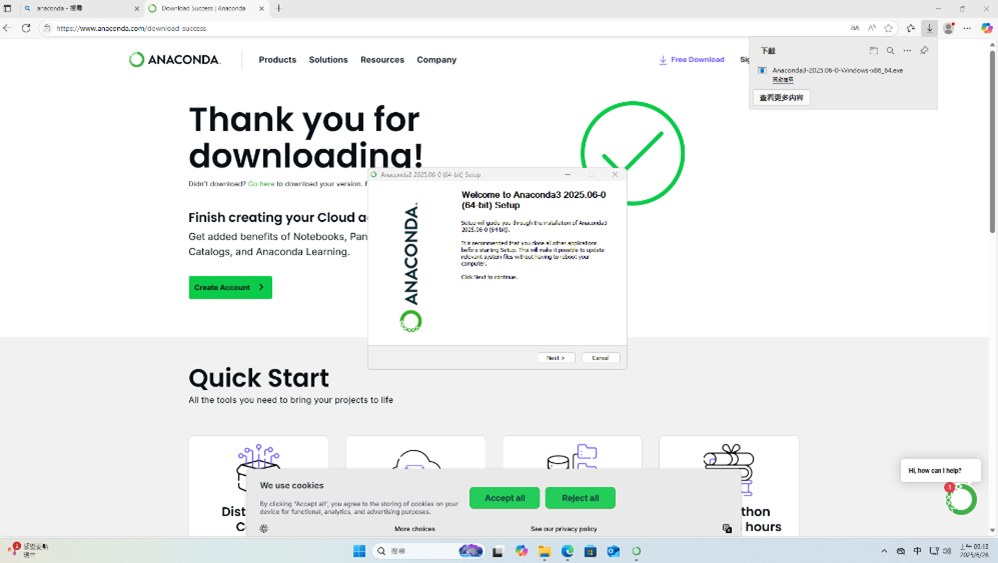

2. **同意授權條款**
   - 點擊 "I Agree" 按鈕
   
   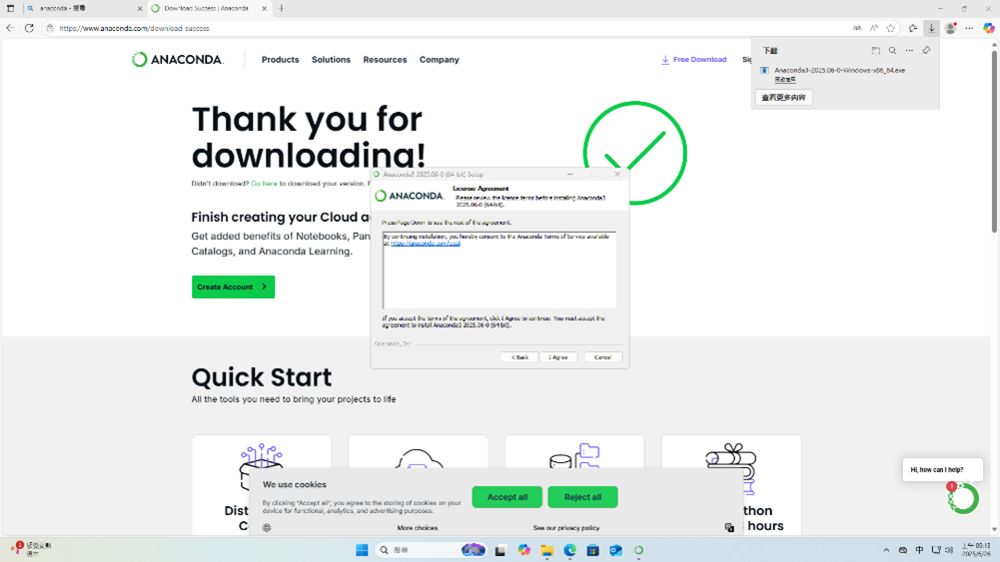

3. **選擇安裝類型**
   - 勾選 "All Users" 選項
   
   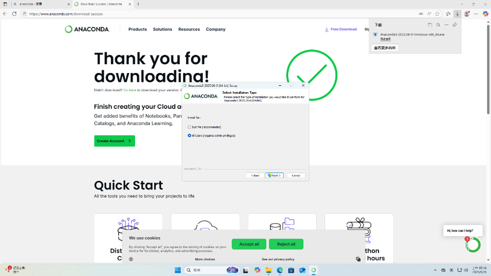

4. **選擇安裝組件**
   - 全選所有選項
   - 點擊下載按鈕
   
   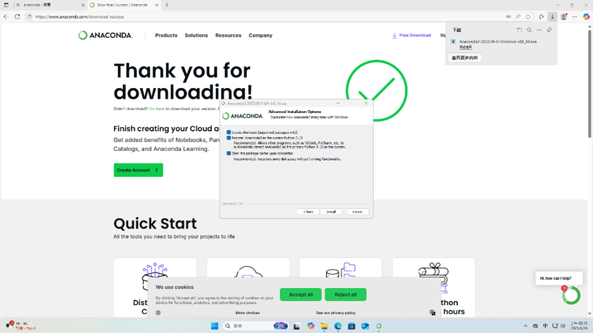

5. **完成安裝**
   - 點擊 "Next"
   
   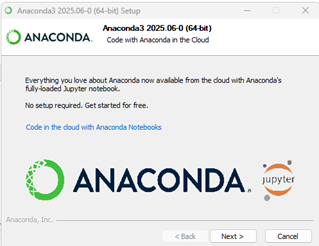
   
   - 點擊 "FINISH" 完成安裝
   
   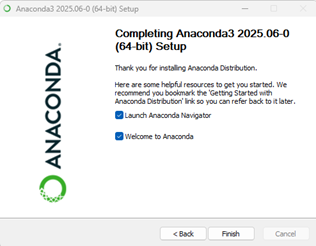

### 3. 登入 Anaconda

1. **選擇登入方式**
   - 選擇 "Sign in"
   
   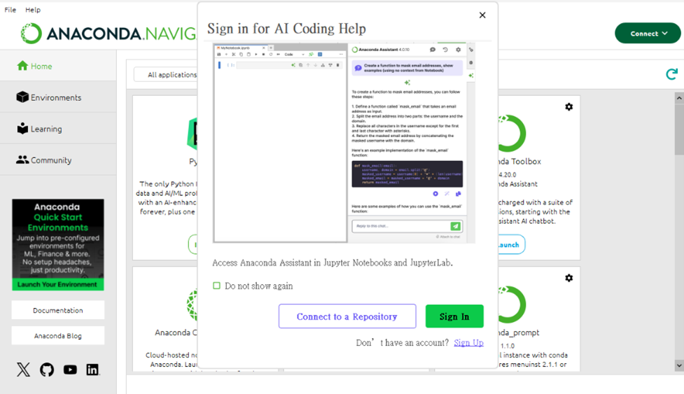
   
2. **使用 GitHub 登入**
   - 選擇 GitHub 選項
   
   
   
3. **輸入帳號密碼**
   - 輸入您的 GitHub 帳號密碼
   
   
   
4. **登入成功**
   - 確認成功登入 Anaconda
   
   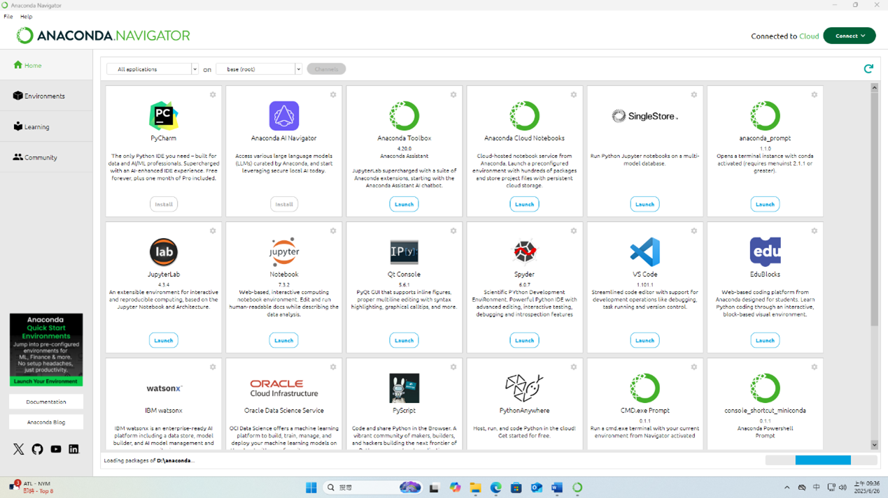

## 建立虛擬環境

### 1. 開啟 Anaconda Prompt

從左下角 Windows 搜尋欄搜尋 "anaconda prompt"


### 2. 建立新環境

```bash
conda create -n 環境名稱 python=版本
```

範例：
```bash
conda create -n myenv python=3.9
```

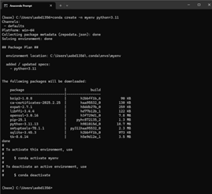

### 3. 啟動虛擬環境

```bash
conda activate myenv
```

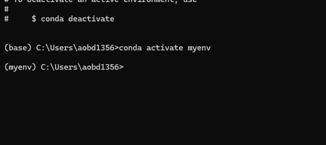

## VS Code 設定

### 1. 安裝 Python 插件

在 VS Code 的擴充功能中搜尋並安裝 Python 插件

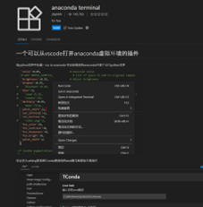

### 2. 選擇 Python 解譯器

1. 按下 `Ctrl + Shift + P` 開啟命令面板
   
2. 輸入 "select interpreter"
   
   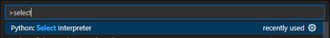
   
3. 選擇 "Python: Select Interpreter"
   
4. 找到並選擇您剛建立的虛擬環境

   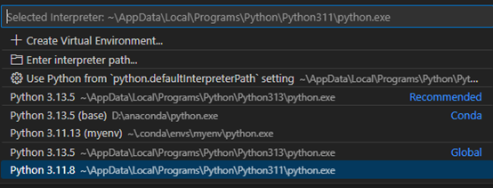

## 注意事項

- 確保在安裝過程中選擇 "All Users" 選項，以便所有使用者都能使用 Anaconda
- 建立虛擬環境時，請根據您的專案需求選擇適當的 Python 版本
- 在 VS Code 中切換到正確的虛擬環境後，即可開始您的 Python 開發工作

## 常用指令

```bash
# 查看所有環境
conda env list

# 刪除環境
conda remove -n 環境名稱 --all

# 安裝套件
conda install 套件名稱

# 更新套件
conda update 套件名稱
```

