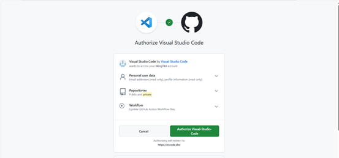

# Git 與 GitHub 設定指南

本指南將引導您完成 GitHub 帳號創建、Git 安裝，以及 VS Code 與 GitHub 的整合設定。
by 黃彥銘、莊淯任
## 目錄

- [創建 GitHub 帳號](#創建-github-帳號)
- [安裝 Git](#安裝-git)
- [VS Code 與 GitHub 整合](#vs-code-與-github-整合)
- [基本操作流程](#基本操作流程)

## 創建 GitHub 帳號

### 1. 前往 GitHub 網站

訪問 [https://github.com/](https://github.com/)


### 2. 註冊新帳號

點擊右上角的 "Sign up" 按鈕


### 3. 填寫註冊資訊

創建您的 GitHub 帳號

### 4. 登入帳號

使用您剛創建的帳號登入


### 5. 創建第一個 Repository

創建一個 GitHub repository（至少包含一個檔案）


## 安裝 Git

### 6. 下載 Git GUI

下載並安裝 Git GUI 工具

### 7. 選擇專案資料夾

選擇您想要發布到 GitHub 的資料夾


## VS Code 與 GitHub 整合

### 8. 連接 VS Code 和 GitHub

在 VS Code 中設定 GitHub 連接



### 9. 設定 Git 使用者資訊

在 VS Code 的終端機中（按 `Ctrl + ~` 開啟），執行以下命令：

```bash
git config --global user.name "您的名字"
git config --global user.email "您的信箱"
```


請將 "您的名字" 和 "您的信箱" 替換為您的實際資訊。

### 10. 確認連接成功

成功連接到 GitHub


## 基本操作流程

### 11. 檢視檔案變更

當您修改檔案內容後，變更的檔案會在本地顯示，並可與原始檔案進行比較


### 12. 提交變更 (Commit)

提交您的變更（必須填寫提交訊息）

> **注意**：如果出現警告訊息，不用擔心，按 "Yes" 即可


### 13. 同步至雲端 (Sync)

同步以替換雲端儲存的檔案


### 14. 查看變更歷史

變更歷史會顯示在左下角的列表中


### 15. 在 GitHub 上查看

您也可以在 GitHub 網站上查看變更記錄


## 常用 Git 指令

```bash
# 初始化 Git repository
git init

# 新增所有變更的檔案
git add .

# 提交變更
git commit -m "提交訊息"

# 推送到遠端
git push origin main

# 拉取遠端變更
git pull origin main

# 查看狀態
git status

# 查看提交歷史
git log
```

## 注意事項

1. **首次使用**：請確保已設定使用者名稱和電子郵件
2. **提交訊息**：每次提交都需要填寫有意義的提交訊息
3. **同步頻率**：建議定期同步您的變更，避免衝突
4. **分支管理**：對於大型專案，建議使用分支進行開發

## 疑難排解

### 無法推送到 GitHub

1. 檢查網路連接
2. 確認 GitHub 帳號權限
3. 驗證遠端 repository URL 是否正確

### 合併衝突

當多人同時修改同一檔案時可能發生衝突：
1. 拉取最新的變更
2. 手動解決衝突
3. 重新提交並推送

## 相關資源

- [Git 官方文件](https://git-scm.com/doc)
- [GitHub 文件](https://docs.github.com/)
- [VS Code Git 整合指南](https://code.visualstudio.com/docs/editor/versioncontrol)
