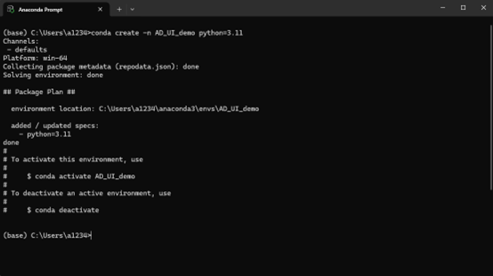

# Poetry 套件管理指南

Poetry 是 Python 的現代化依賴管理和打包工具，可以更有效地管理專案套件。

## 目錄

- [安裝 Poetry](#安裝-poetry)
- [在 Anaconda 環境中安裝 Poetry](#在-anaconda-環境中安裝-poetry)
- [建立新專案](#建立新專案)
- [在現有專案中使用 Poetry](#在現有專案中使用-poetry)
- [常用指令](#常用指令)
- [疑難排解](#疑難排解)

## 安裝 Poetry

### 方法一：使用 PowerShell 安裝（Windows）

1. **開啟 Windows PowerShell**

2. **設定安裝路徑並執行安裝**
   ```powershell
   $env:POETRY_HOME = "您想安裝的資料夾路徑"
   (Invoke-WebRequest -Uri https://install.python-poetry.org -UseBasicParsing).Content | python -
   ```

3. **設定環境變數**
   - 開啟「編輯系統環境變數」
   - 點選「環境變數」
   
   

4. **新增 Poetry 到 PATH**
   - 在使用者變數中找到 Path
   - 新增 `您的安裝路徑/bin`

### 方法二：在 Anaconda 環境中安裝 Poetry（推薦）

這是 AD-Sensor-Project 使用的方法：

1. **建立 Poetry 專用環境**
   ```bash
   conda create -n poetry_env python=3.11
   ```
   
   

2. **啟動 Poetry 環境**
   ```bash
   conda activate poetry_env
   ```
   
   

3. **安裝 Poetry**
   ```bash
   pip install poetry
   ```
   
   

4. **將 Poetry 環境加入 PATH**
   ```
   C:\Users\{您的使用者名稱}\anaconda3\envs\poetry_env\Scripts
   ```
   
   

## 建立新專案

### 1. 使用 Poetry 建立新專案

```bash
poetry new 專案名稱
```

### 2. 進入專案目錄

```bash
cd 專案名稱
```

### 3. 初始化 Poetry（如果是現有專案）

```bash
poetry init
```

### 4. 設定虛擬環境位置

將虛擬環境設定在專案資料夾內：
```bash
poetry config virtualenvs.in-project true
```

### 5. 安裝虛擬環境

```bash
poetry install
```

## 在現有專案中使用 Poetry

以 AD-Sensor-Project 為例：

1. **建立專案工作環境**
   ```bash
   conda create -n AD_UI_env python=3.11
   ```
   
   

2. **啟動專案環境**
   ```bash
   conda activate AD_UI_env
   ```
   
   

3. **進入專案目錄**
   ```bash
   cd {your_save_path}/AD-Sensor-Project
   ```
   
   

4. **使用 Poetry 安裝專案依賴**
   ```bash
   poetry install --no-root
   ```
   
   
   

## VS Code 整合

### 1. 在 VS Code 中開啟專案資料夾

### 2. 選擇 Python 解譯器
   - 按下 `Ctrl + Shift + P`
   - 輸入 "Python: Select Interpreter"
   - 選擇帶有 poetry 的虛擬環境路徑

### 3. 在 Terminal 中新增套件
   ```bash
   poetry add 套件名稱
   ```

### 4. 程式碼撰寫
   - 在 `src/專案名稱/` 資料夾中新增 `main.py` 或 `.ipynb`
   - `__init__.py` 檔案不需要修改

## 常用指令

### 套件管理
```bash
# 新增套件
poetry add package_name

# 新增開發依賴
poetry add --dev package_name

# 移除套件
poetry remove package_name

# 更新套件
poetry update package_name

# 顯示已安裝套件
poetry show

# 顯示套件樹狀結構
poetry show --tree
```

### 環境管理
```bash
# 啟動虛擬環境
poetry shell

# 執行指令（在虛擬環境中）
poetry run python main.py

# 查看環境資訊
poetry env info

# 列出所有環境
poetry env list
```

### 專案管理
```bash
# 初始化專案
poetry init

# 安裝所有依賴
poetry install

# 只安裝生產環境依賴
poetry install --no-dev

# 從 requirements.txt 匯入
poetry add $(cat requirements.txt)
```

## pyproject.toml 說明

Poetry 使用 `pyproject.toml` 來管理專案設定和依賴：

```toml
[tool.poetry]
name = "your-project"
version = "0.1.0"
description = "專案描述"
authors = ["Your Name <email@example.com>"]

[tool.poetry.dependencies]
python = "^3.11"
numpy = "^1.24.0"

[tool.poetry.dev-dependencies]
pytest = "^7.0"

[build-system]
requires = ["poetry-core>=1.0.0"]
build-backend = "poetry.core.masonry.api"
```

## poetry.lock 說明

- `poetry.lock` 檔案記錄了所有依賴的確切版本
- 確保團隊成員安裝相同版本的套件
- 應該加入版本控制（git commit）
- 使用 `poetry install` 會根據此檔案安裝套件

## 疑難排解

### Poetry 指令無法使用
1. 確認 Poetry 已加入 PATH
2. 重新開啟終端機或 PowerShell
3. 使用 `poetry --version` 檢查安裝

### 虛擬環境找不到
1. 使用 `poetry env info` 查看環境位置
2. 確認 `poetry config virtualenvs.in-project true` 設定
3. 重新執行 `poetry install`

### 套件安裝失敗
1. 檢查 Python 版本相容性
2. 清除快取：`poetry cache clear pypi --all`
3. 使用 `--verbose` 查看詳細錯誤：`poetry add package_name --verbose`

### 與 Anaconda 環境衝突
1. 確保在正確的 conda 環境中
2. 避免混用 pip 和 poetry 安裝套件
3. 使用 `poetry run` 確保在 Poetry 環境中執行

## 最佳實踐

1. **專案初期就使用 Poetry** - 避免後期轉換的麻煩
2. **定期更新 poetry.lock** - 保持依賴的安全性
3. **使用語意化版本** - 在 pyproject.toml 中明確指定版本範圍
4. **分離開發和生產依賴** - 使用 `--dev` 標記開發工具
5. **使用 poetry run** - 確保在正確的環境中執行程式

## 相關資源

- [Poetry 官方文件](https://python-poetry.org/docs/)
- [Poetry GitHub](https://github.com/python-poetry/poetry)
- [PyPI - Python Package Index](https://pypi.org/)